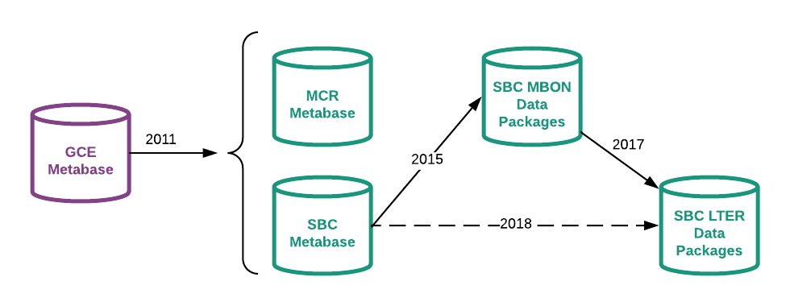

<section id="categories" markdown="1">
# Metabase History

<table>
<tr>
<th>
&nbsp;
</th>

<th>
GCE metabase
</th>

<th>
SBC, MCR metabase
</th>

<th>
SBC MBON data packages
</th>

<th>
SBC LTER data packages
</th>

</tr>

<tr>
<th>
Uses
</th>

<td>
<ul>
<li>GCE matlab toolbox, 
<li>drives GCE website (people, biblio, datasets, projects, other)
<li>Annual report contributions

</td>

<td>
<ul>
<li>Initial
<ul>
<li>datasets: all EML content, management tools (EML exported)
<li>research projects: all content for research projects (lterProject XML exported)
</ul>
<li>Anticipated 
<ol>
<li>drive website (part)
<li>biblio mgmt
<li>GCE Toolbox

</td>

<td>
<ul>
<li>Assemble EML records with R
<li>EML text content in external files
</td>

<td>
<ul>
<li>Dataset construction with R
<li>Anticipated 
<ol>
<li>drive website (part, TBD)
<li>biblio mgmt
</td>

</tr>

<tr>
<th>
Features
</th>

<td>
<ul>
<li>SQL server
<li>num schemas: ___
<li>Num tables: ___

</td>

<td>
<ul>
<li>PostgreSQL
<li>MCR, SBC schemas synchronized
<li>uses built-in XML data type
<li>num schemas: 5
<li>num tables: ___
</td>

<td>
<ul>
<li>PostgreSQL
<li>num schemas: 3
<li>num tables: 22, 6 (10 views)
</td>

<td>
<ul>
<li>PostgreSQL
<li>num schemas: ___
<li>num tables: ___
</td>

</tr>

<tr>
<th>
Activities
</th>

<td>
col1
</td>

<td>
2011
<ul>
<li>Ported to postgreSQL
<li>populated project schema

</ul>
2013
<ul>
<li>populated tables for datasets (16)
<li>___ forks 
<li>added 2 schemas: mb2EML (for export), pkg_mgmt
</ul>

</td>

<td>
2015
<ul>
<li>dropped empty tables 
<li>replaced XML-typed fields
<li>tailored views for EML production with R
</td>

<td>
2017
<ul>
<li>copy schema, migrate content
</ul>
2018
<ul>
<li>judicious additions from sbc_metabase, to meet anticipated uses (above)
</td>

</tr>
</table>

## Further Reading
Gastil-Buhl, M. and M. O'Brien. 2013.
Data Package Inventory Tracking: Slicing and Dicing with SQL.
LTER Spring 2013 Databits.

Kui Li and M. O’Brien. 2018.
Postgres, EML and R in a data management workflow.
LTER Spring 2018 Databits.

O'Brien M. and M. Gastil-Buhl. 2013.
Metabase Adoption by SBC and MCR
LTER Spring 2013 Databits.

O'Brien, M. 2011.
The Santa Barbara Coastal (SBC) LTER's implementation of projectDB using Metabase
LTER Fall 2011 Databits.

Sheldon, W.M. Jr., J. F. Chamblee, and R. Cary. 2012. 
Poster: GCE Data Toolbox and Metabase: A
sensor-to-synthesis software pipeline for LTER data management. 2012 LTER All Scientists Meeting,
11-Sep-2012, Estes Park, Colorado.

Sheldon W. and J. Carpenter, 2010. 
Implementing ProjectDB at the Georgia Coastal Ecosystems. 
LTER Fall 2010 Databits.

## Other Related GitHub Repositories
**Code to read from SBC or MCR metabase, create EML records**: 
https://github.com/mobb/MB2EML

**Code for SBC metabase maintenance (incomplete)**:
https://github.com/mobb/MBmaint

